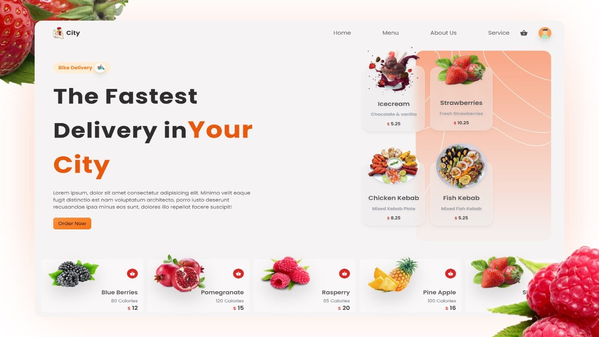

> Fullstack Food Delivery Application using ReactJs
> [Follow Us](https://codewithvetri.web.app)



# To check the node version

```
node --version
```

# To initialize the Firebase console

```
firebase init
```

# To start the server

```
npm run serve
```

# To create react project using npm & yarn

```
npm create-react-app folder_name
```

```
yarn create react-app folder_name
```

# To start the client

```
yarn start
```

> Packages Used

<!-- prettier-ignore -->
| Name
|------------------------------------------------
| ReactJs
| Tailwind CSS
| Firebase Functions
| Express
| React Router DOM
| Framer Motion
| React Icons
